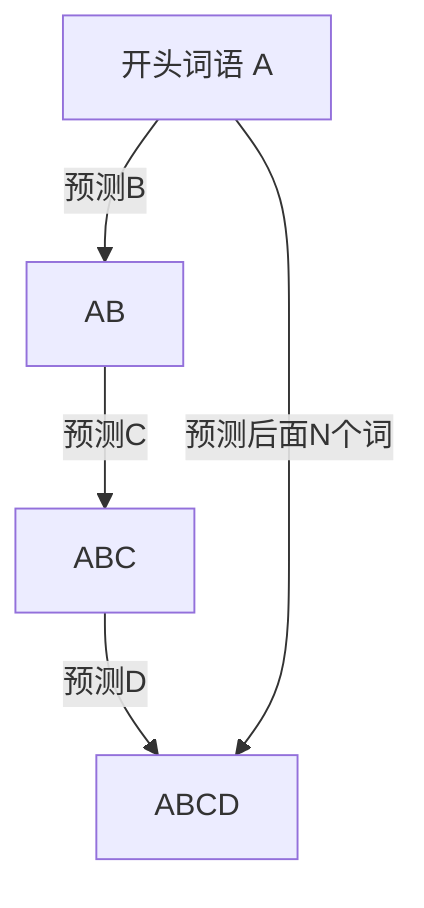

## 1. 背景

我有两个爱好，一个是传统文化，另一个是高新技术。

传统文化，我喜欢唐诗宋词、笔墨丹青，高新技术我则从事前沿的IT编程，喜欢研究人工智能。

我很想让这两者联系起来，这一老一新，不知道会碰撞出什么火花。

## 2. 成果

通过试验，利用循环神经网络结合文本生成，我最终练成神功：提供一个开头，他就会自动生成一篇宋词。而且，这篇新词绝对是原创。
| 开头 | 生成 |
| --- | --- |
| 细雨 |细雨仙桂春。明月此，梦断在愁何。等闲帘寒，归。正在栖鸦啼来。|
| 清风 |清风到破向，貌成眠无风。人在梦断杜鹃风韵。门外插人莫造。怯霜晨。|
| 高楼 |高楼灯火，九街风月。今夜楼外步辇，行时笺散学空。但洗。俯为人间五色。|
| 海风 |海风落今夜，何处凤楼偏好。奇妙。残月破。将心青山上，落分离。|
| 今夜 |今夜谁和泪倚阑干。薰风却足轻。似泠愁绪。似清波似玉人。羞见。|

对于诗词稍有研究的我，对于上面“高楼”一词生成的文本，比较满意。

> 高楼灯火，九街风月。今夜楼外步辇，行时笺散学空。但洗。俯为人间五色。 

高楼处在高处，后面的文本也体现了“高”的特色，“高楼望街”是一番意境，“高楼望夜”又是另一番意境，最后出了一个“俯看五色”，一个“俯”字，也是体现了居高临下，整篇文本无不围绕“高”的主题。实乃绝妙！

下面就来剖析下，宋词生成是如何实现的。

## 3. 实现方式

### 3.1 数据的准备

我找到了一个宋词数据集，是一个csv格式的文件，里面有2万首宋词。

文档的第一列是词牌名，第二列是作者，第三列是正文。其中正文，已经做好了分词处理。

> 想要了解分词，可以查看[NLP知识点：中文分词](https://juejin.cn/post/7028579355643265038#heading-9)。


### 3.2 数据的读入

首先导入整个项目涉及到的包。

```python
import csv
import tensorflow as tf
from tensorflow.keras.preprocessing.text import Tokenizer
from tensorflow.keras.preprocessing.sequence import pad_sequences
import numpy as np
from tensorflow.python.keras.engine.sequential import Sequential
from tensorflow.keras import layers
from tensorflow.keras.optimizers import Adam
```

下面是加载数据集文件中数据的方法。
```python
def load_data(num = 1000):
      
    # 读取csv文件。表头：0 题目| 1 作者| 2 内容
    csv_reader = csv.reader(open("./ci.csv",encoding="gbk"))
    # 以一首词为单位存储
    ci_list = []
    for row in csv_reader:
        # 取每一行，找到词内容那一列
        ci_list.append(row[2])
        #　超过最大数量退出循环，用多少取多少
        if len(ci_list) > num:break 
    return ci_list
```
> 想要详细了解如何加载csv数据集，可以查看[NLP知识点：CSV格式的读取](https://juejin.cn/post/7029165733598724103#heading-4)。

然后进行数据序列化。

```python
def get_train_data():
      
    # 加载数据作为语料库["春花 秋月","一江 春水 向东 流"]
    corpus = load_data()
    # 定义分词器
    tokenizer = Tokenizer()
    # 分词器适配文本，将语料库拆分词语并加索引{"春花":1,"秋月":2,"一江":3}
    tokenizer.fit_on_texts(corpus)

    # 定义输入序列
    input_sequences = []
    # 从语料库取出每一条
    for line in corpus:
        # 序列成数字 "一江 春水 向东 流" ->[3,4,5,6]
        token_list = tokenizer.texts_to_sequences([line])[0]
        # 截取字符[3,4,5,6]变成[3,4],[3,4,5],[3,4,5,6]
        for i in range(1, len(token_list)):
            n_gram_sequence = token_list[:i+1]
            input_sequences.append(n_gram_sequence)
    # 找到语料库中最大长度的一项
    max_sequence_len = max([len(x) for x in input_sequences])
    # 填充序列每一项到最大长度，采用前面补0的方式
    input_sequences = np.array(pad_sequences(input_sequences, maxlen=max_sequence_len, padding='pre'))

    return tokenizer, input_sequences, max_sequence_len
```
> 关于为什么要把文本进行序列化，以及如何序列化，可以前往知识点[Tokenizer](https://juejin.cn/post/7028579355643265038#heading-1)、[texts_to_sequences](https://juejin.cn/post/7028579355643265038#heading-5)、[pad_sequences](https://juejin.cn/post/7028579355643265038#heading-7)查看详细说明。

这里要重点说明一下，因为要做文本预测的训练，需要从上面的词语推断出下面的词语，所以这里做了一些加工。

比如“看山 不是 山 ， 看山 又是 山”这一句，它给转化成了多句：
```
看山 不是
看山 不是 山 
看山 不是 山 ，
看山 不是 山 ， 看山
看山 不是 山 ， 看山 又是
看山 不是 山 ， 看山 又是 山
```

这么做的目的就是告诉神经网络，如果前面是“看山”，后面跟一个词语是“不是”。当前面变成“看山 不是 山 ， 看山”时，这时“看山”后面就变成“又是”了。

“看山”后面并不是固定的，而是根据它前面一串词语综合判断而决定的。

将一句话，切成多句话，这是一个特殊处理的地方，就是下面代码做的事情：

```python
for i in range(1, len(token_list)):
    n_gram_sequence = token_list[:i+1]
    input_sequences.append(n_gram_sequence)
```

### 3.3 构建模型

要训练数据，我们首先得有一个神经网络模型，下面是构建了一个网络模型序列。

```python
def create_model(vocab_size, embedding_dim, max_length):
    
    # 构建序列模型
    model = Sequential()
    # 添加嵌入层
    model.add(layers.Embedding(vocab_size, embedding_dim, input_length = max_length))
    # 添加长短时记忆层
    model.add(layers.Bidirectional(layers.LSTM(512)))
    # 添加softmax分类
    model.add(layers.Dense(vocab_size, activation='softmax'))
    # adam优化器
    adam = Adam(lr=0.01)
    # 配置训练参数
    model.compile(loss='categorical_crossentropy',optimizer=adam, metrics=['accuracy'])

    return model
```

> 关于模型、层、激活函数的知识点，有专门解释：[神经网络模型的序列和层](https://juejin.cn/post/7034156187100643364)、[激活函数](https://juejin.cn/post/7035617168729309214)。

### 3.4 进行训练

训练的代码如下：

```python
# 分词器，输入序列，最大序列长度
tokenizer, input_sequences, max_sequence_len = get_train_data()
# 得出有多少个词，然后+1，1是统一长度用的填充词
total_words = len(tokenizer.word_index) + 1

# 从语料库序列中拆分出输入和输出，输入是前面几个词，输出是最后一个词
xs = input_sequences[:,:-1]
labels = input_sequences[:,-1]

# 结果转为独热编码
ys = tf.keras.utils.to_categorical(labels, num_classes=total_words)
# 创建模型
model = create_model(total_words, 256, max_sequence_len-1)
# 进行训练
model.fit(xs, ys, epochs= 15, verbose=1)

# 保存训练的模型
model_json = model.to_json()
with open('./save/model.json', 'w') as file:
    file.write(model_json)
# 保存训练的权重
model.save_weights('./save/model.h5')
```

假设我们得到了训练序列input_sequences是：

```
[0, 0, 1, 2]
[0, 0, 3, 4]
[0, 3, 4, 5]
[3, 4, 5, 6]
```

对应文字就是：
```
[0,    0,    春花,  秋月]
[0,    0,    一江,  春水]
[0,    一江, 春水,  向东]
[一江, 春水, 向东,    流]
```

对于训练，一般都是成对的。一个输入，一个输出。机器将学习从输入推断出输出的诀窍。

在这个例子中，因为是从上一个词推断出下一个词，所以输入和输出都要从上面的语料库中来取。

下面这段代码就是从input_sequences取出了输入和输出：
```python
xs = input_sequences[:,:-1] 
labels = input_sequences[:,-1]
```

| 输入 xs | 输出 labels |
| --- | --- |
| [0,    0,    春花] | [秋月] |
| [0,    0,    一江] | [春水] |
| [0,    一江, 春水] | [向东] |
| [一江, 春水, 向东] | [流  ] |

因为模型里面激活函数使用了`activation='softmax'`，所以这个输出要通过`tf.keras.utils.to_categorical`转化成了独热编码。

> 如果对独热编码有疑问，可以查看[《知识点：独热编码》](https://juejin.cn/post/7035725364605222943)。


此时，需要强调几个概念：
- 文本序列的最大长度`max_sequence_len`就是`[一江, 春水, 向东， 流]`的长度，此处值为4。主要作用是定义一个固定的训练长度，长度不足时补0，超出时裁剪。

> 为什么要这么做，可以[点击此处了解](https://juejin.cn/post/7028579355643265038#heading-8)。

- 输入序列的长度`input_length`就是`[0,    一江, 春水]`的长度，固定为3，是从`max_sequence_len`截取出来的，最后一个词不要。主要作用是作为输入。

> 关于上面的模型数据的保存，有兴趣的可以看知识点：[模型保存为json和h5格式](https://juejin.cn/post/7031445237428191269#heading-4)。

### 3.5 进行预测

训练完成之后，我们就可以享受胜利果实，开始进行预测了。

预测代码如下：

```python
def predict(seed_text, next_words = 20):

    # 分词器，输入序列，最大序列长度
    tokenizer, input_sequences, max_sequence_len = get_train_data()

    # 读取训练的模型结果
    with open('./save/model.json', 'r') as file:
        model_json_from = file.read()
    model = tf.keras.models.model_from_json(model_json_from)
    model.load_weights('./save/model.h5')

    # 假如要预测后面next_words=20个词，那么需要循环20词，每次预测一个
    for _ in range(next_words):
        # 将这个词序列化 如传来“高楼”,则从词库中找高楼的索引为50，序列成[50]
        token_list = tokenizer.texts_to_sequences([seed_text])[0]
        # 填充序列每一项到最大长度，采用前面补0的方式[0,0……50]
        token_list = pad_sequences([token_list], maxlen= max_sequence_len-1, padding='pre')
        # 预测下一个词，预测出来的是索引
        predicted = model.predict_classes(token_list, verbose = 0)
        # 定义一个输出存储输出的数值
        output_word = ''
        # 找到预测的索引是哪一个词，比如55是“灯火”
        for word, index in tokenizer.word_index.items():
            if index == predicted:
                output_word = word
                break
        # 输入+输出，作为下一次预测：高楼 灯火
        seed_text = seed_text + " " + output_word

    print(seed_text)
    # 替换空格返回
    return seed_text.replace(' ' , '')

# 预测数据
print(predict('细雨',next_words = 22))
# 细雨仙桂春。明月此，梦断在愁何。等闲帘寒，归。正在栖鸦啼来。
```

> 关于上面的模型数据的读取，有兴趣的可以看知识点：[读取json、h5文件恢复模型](https://juejin.cn/post/7031445237428191269#heading-5)。

预测需要给一个开头的词语，并且指定后面需要预测多少个词语。




首先，根据开始的词语，通过`model.predict_classes(token_list)`预测出下一个词语，接着开头词语连同预测词语两方再作为输入，继续预测下一个词语。如此类推，像贪吃蛇一样，从一个开头词语慢慢地引出一个长句子。句子中每个词语是有语义上的前后关系的。

这就是宋词生成器的实现逻辑，希望对你有所帮助。
